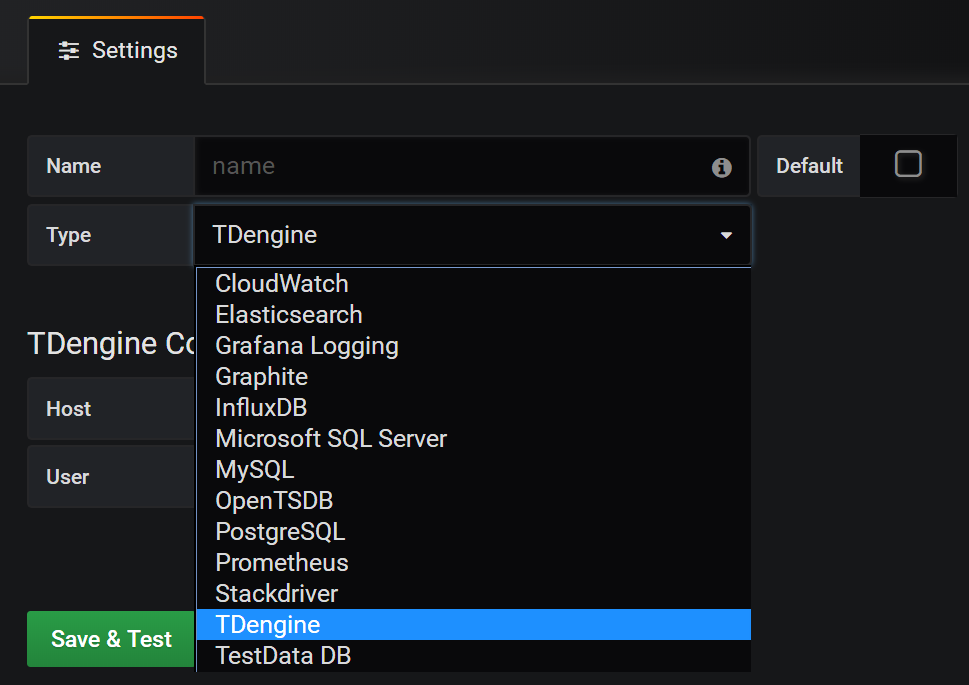
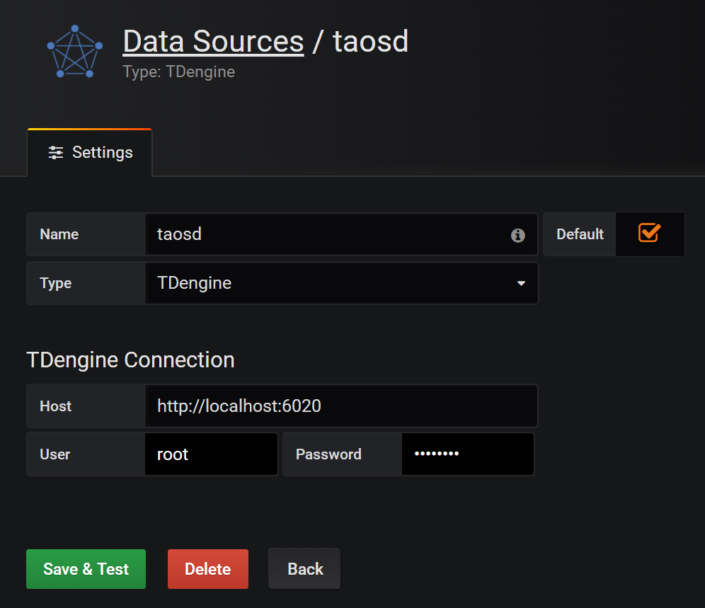
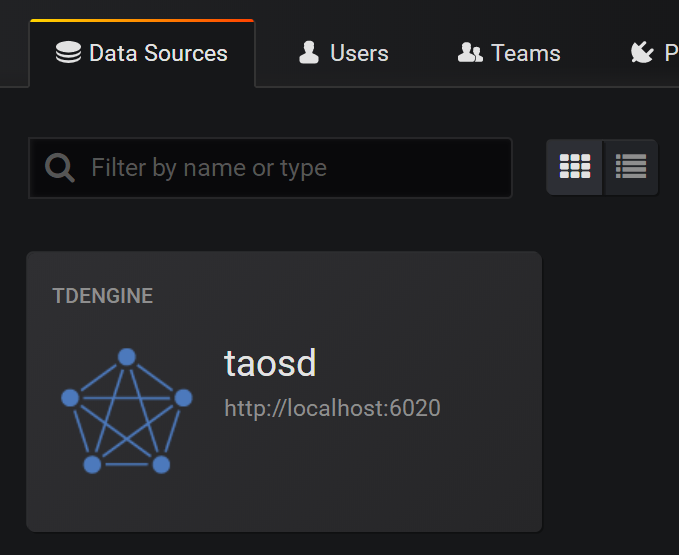
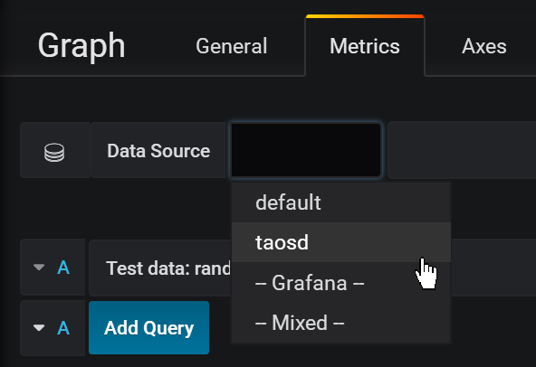
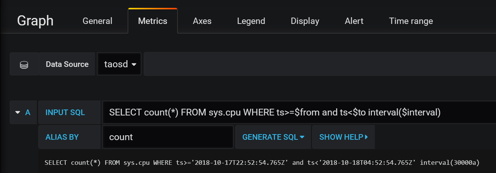

# 与其他工具的连接

## Telegraf

TDengine能够与开源数据采集系统[Telegraf](https://www.influxdata.com/time-series-platform/telegraf/)快速集成，整个过程无需任何代码开发。

### 安装Telegraf

目前TDengine支持Telegraf 1.7.4以上的版本。用户可以根据当前的操作系统，到Telegraf官网下载安装包，并执行安装。下载地址如下：https://portal.influxdata.com/downloads

### 配置Telegraf

修改Telegraf配置文件/etc/telegraf/telegraf.conf中与TDengine有关的配置项。 

在output plugins部分，增加[[outputs.http]]配置项： 

- url：http://ip:6020/telegraf/udb，其中ip为TDengine集群的中任意一台服务器的IP地址，6020为TDengine RESTful接口的端口号，telegraf为固定关键字，udb为用于存储采集数据的数据库名称，可预先创建。
- method: "POST" 
- username: 登录TDengine的用户名
- password: 登录TDengine的密码
- data_format: "json"
- json_timestamp_units:      "1ms"

在agent部分：

- hostname: 区分不同采集设备的机器名称，需确保其唯一性
- metric_batch_size: 30，允许Telegraf每批次写入记录最大数量，增大其数量可以降低Telegraf的请求发送频率，但对于TDengine，该数值不能超过50

关于如何使用Telegraf采集数据以及更多有关使用Telegraf的信息，请参考Telegraf官方的[文档](https://docs.influxdata.com/telegraf/v1.11/)。

## Grafana

TDengine能够与开源数据可视化系统[Grafana](https://www.grafana.com/)快速集成搭建数据监测报警系统，整个过程无需任何代码开发，TDengine中数据表中内容可以在仪表盘(DashBoard)上进行可视化展现。

### 安装Grafana

目前TDengine支持Grafana 5.2.4以上的版本。用户可以根据当前的操作系统，到Grafana官网下载安装包，并执行安装。下载地址如下：https://grafana.com/grafana/download

### 配置Grafana

TDengine的Grafana插件在安装包的/usr/local/taos/connector/grafana目录下。

以CentOS 7.2操作系统为例，将tdengine目录拷贝到/var/lib/grafana/plugins目录下，重新启动grafana即可。

### 使用Grafana

用户可以直接通过localhost:3000的网址，登录Grafana服务器(用户名/密码:admin/admin)，配置TDengine数据源，如下图所示，此时可以在下拉列表中看到TDengine数据源。 



TDengine数据源中的HTTP配置里面的Host地址要设置为TDengine集群的中任意一台服务器的IP地址与TDengine RESTful接口的端口号(6020)。假设TDengine数据库与Grafana部署在同一机器，那么应输入：http://localhost:6020。

此外，还需配置登录TDengine的用户名与密码，然后点击下图中的Save&Test按钮保存。  



  

然后，就可以在Grafana的数据源列表中看到刚创建好的TDengine的数据源：



 

基于上面的步骤，就可以在创建Dashboard的时候使用TDengine数据源，如下图所示： 



 

然后，可以点击Add Query按钮增加一个新查询。

在INPUT SQL输入框中输入查询SQL语句，该SQL语句的结果集应为两行多列的曲线数据，例如SELECT count(*) FROM sys.cpu WHERE ts>=from and ts<​to interval(interval)。其中，from、to和interval为TDengine插件的内置变量，表示从Grafana插件面板获取的查询范围和时间间隔。

ALIAS BY输入框为查询的别名，点击GENERATE SQL 按钮可以获取发送给TDengine的SQL语句。如下图所示： 



 

关于如何使用Grafana创建相应的监测界面以及更多有关使用Grafana的信息，请参考Grafana官方的[文档](https://grafana.com/docs/)。

## Matlab

MatLab可以通过安装包内提供的JDBC Driver直接连接到TDengine获取数据到本地工作空间。

### MatLab的JDBC接口适配

MatLab的适配有下面几个步骤，下面以Windows10上适配MatLab2017a为例：

- 将TDengine安装包内的驱动程序JDBCDriver-1.0.0-dist.jar拷贝到${matlab_root}\MATLAB\R2017a\java\jar\toolbox
- 将TDengine安装包内的taos.lib文件拷贝至${matlab_ root _dir}\MATLAB\R2017a\lib\win64
- 将新添加的驱动jar包加入MatLab的classpath。在${matlab_ root _dir}\MATLAB\R2017a\toolbox\local\classpath.txt文件中添加下面一行

​          `$matlabroot/java/jar/toolbox/JDBCDriver-1.0.0-dist.jar`

- 在${user_home}\AppData\Roaming\MathWorks\MATLAB\R2017a\下添加一个文件javalibrarypath.txt, 并在该文件中添加taos.dll的路径，比如您的taos.dll是在安装时拷贝到了C:\Windows\System32下，那么就应该在javalibrarypath.txt中添加如下一行：

​          `C:\Windows\System32`

### 在MatLab中连接TDengine获取数据

在成功进行了上述配置后，打开MatLab。

- 创建一个连接：

  `conn = database(‘db’, ‘root’, ‘taosdata’, ‘com.taosdata.jdbc.TSDBDriver’, ‘jdbc:TSDB://127.0.0.1:0/’)`

- 执行一次查询：

  `sql0 = [‘select * from tb’]`

  `data = select(conn, sql0);`

- 插入一条记录:

  `sql1 = [‘insert into tb values (now, 1)’]`

  `exec(conn, sql1)`

更多例子细节请参考安装包内examples\Matlab\TDengineDemo.m文件。

## R 

R语言支持通过JDBC接口来连接TDengine数据库。首先需要安装R语言的JDBC包。启动R语言环境，然后执行以下命令安装R语言的JDBC支持库：

```R
install.packages('rJDBC', repos='http://cran.us.r-project.org')
```

安装完成以后，通过执行`library('RJDBC')`命令加载 _RJDBC_ 包：

然后加载TDengine的JDBC驱动：

```R
drv<-JDBC("com.taosdata.jdbc.TSDBDriver","JDBCDriver-1.0.0-dist.jar", identifier.quote="\"")
```
如果执行成功，不会出现任何错误信息。之后通过以下命令尝试连接数据库：

```R
conn<-dbConnect(drv,"jdbc:TSDB://192.168.0.1:0/?user=root&password=taosdata","root","taosdata")
```

注意将上述命令中的IP地址替换成正确的IP地址。如果没有任务错误的信息，则连接数据库成功，否则需要根据错误提示调整连接的命令。TDengine支持以下的 _RJDBC_ 包中函数：


-	dbWriteTable(conn, "test", iris, overwrite=FALSE, append=TRUE)：将数据框iris写入表test中，overwrite必须设置为false，append必须设为TRUE,且数据框iris要与表test的结构一致。
-	dbGetQuery(conn, "select count(*) from test")：查询语句
-	dbSendUpdate(conn, "use db")：执行任何非查询sql语句。例如dbSendUpdate(conn, "use db")， 写入数据dbSendUpdate(conn, "insert into t1 values(now, 99)")等。
-	dbReadTable(conn, "test")：读取表test中数据
-	dbDisconnect(conn)：关闭连接
-	dbRemoveTable(conn, "test")：删除表test

TDengine客户端暂不支持如下函数：
- dbExistsTable(conn, "test")：是否存在表test
- dbListTables(conn)：显示连接中的所有表


